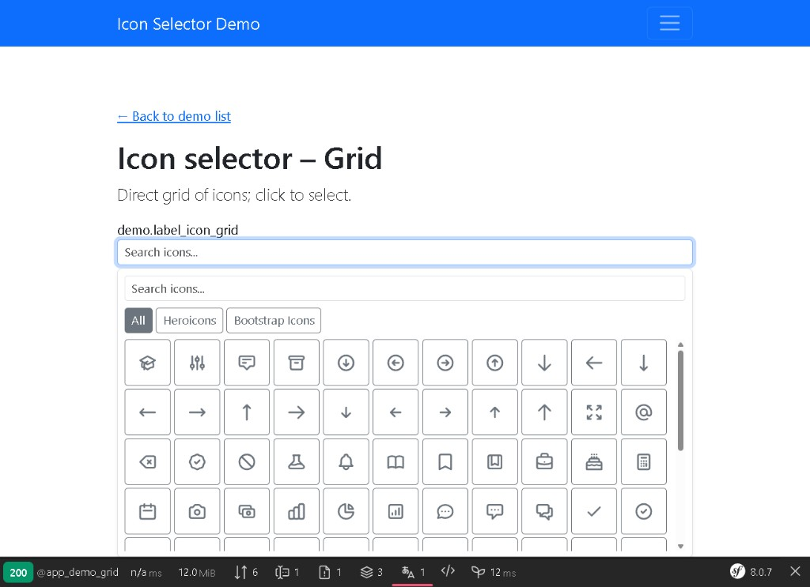
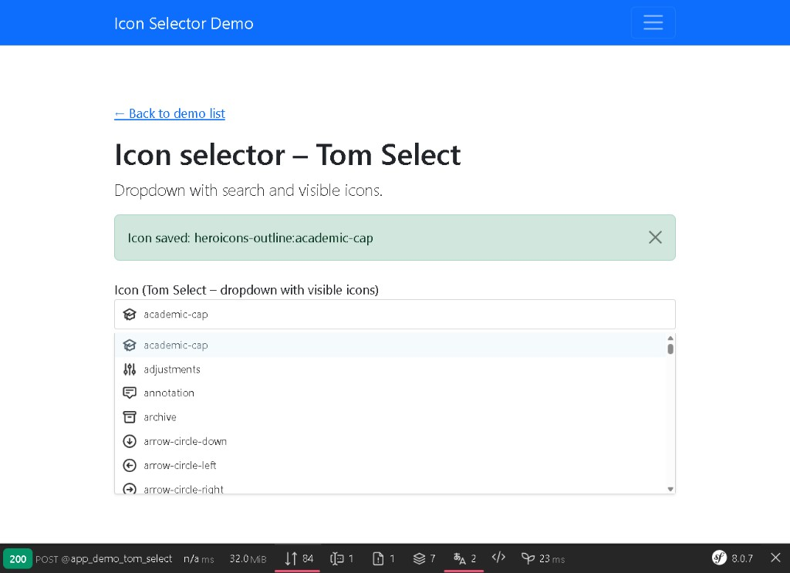

# Icon Selector Bundle

[](https://github.com/nowo-tech/IconSelectorBundle/actions/workflows/ci.yml) [](https://packagist.org/packages/nowo-tech/icon-selector-bundle) [](https://packagist.org/packages/nowo-tech/icon-selector-bundle) [](LICENSE) [](https://php.net) [](https://symfony.com) [](https://github.com/nowo-tech/IconSelectorBundle)

> ⭐ **Found this useful?** [Install from Packagist](https://packagist.org/packages/nowo-tech/icon-selector-bundle) · Give it a **star** on [GitHub](https://github.com/nowo-tech/IconSelectorBundle) so more developers can find it.

**Icon Selector Bundle** — Symfony form type for selecting an icon with two modes: **direct selector** (grid) and **search** (filter by text). The value is stored as a string (e.g. `heroicons-outline:home`, `bi:house`). Configurable icon sets (Symfony UX Icons). For Symfony 7 and 8 · PHP 8.2+.

## Table of contents

- [Quick search terms](#quick-search-terms)
- [Features](#features)
- [Installation](#installation)
- [Usage](#usage)
- [Configuration](#configuration)
- [Internationalization](#internationalization)
- [Documentation](#documentation)
- [Requirements](#requirements)
- [Demo](#demo)
- [Development](#development)
- [License & author](#license--author)

## Quick search terms

Looking for **icon selector**, **icon picker**, **Symfony form icon**, **UX Icons form**, **Heroicons selector**, **Bootstrap Icons form**, **form type icon**? You're in the right place.

## Features

- ✅ **IconSelectorType** form type with `mode`: **direct** (grid of icons) or **search** (input + filtered list)
- ✅ Value is a single **string** (icon identifier compatible with Symfony UX Icons)
- ✅ **Configurable icon sets** in bundle config (e.g. `heroicons`, `bootstrap-icons`)
- ✅ **API endpoint** returns available icons (JSON) for the frontend; **batch SVG endpoint** (`/svg`) returns SVG markup for many icon IDs in one request (server uses ux_icon), so the selector avoids N individual requests when painting icons
- ✅ **Form theme** aligned with your app: set `form_theme` to match `twig.form_themes` (form_div, Bootstrap 5, etc.)
- ✅ **Frontend**: TypeScript + Vite; built script in `Resources/public/` for `assets:install`
- ✅ **Demos** (Symfony 7 and 8) with both selector types, persisting the chosen icon string
- ✅ **Demos run with FrankenPHP** (Caddy, HTTP on port 80, **runtime worker** mode)
- ✅ **Internationalizable**: uses Symfony Translation; domain `NowoIconSelectorBundle` for placeholder, search placeholder and choice labels; override with `translation_domain` and `search_placeholder` options

## Installation

```bash
composer require nowo-tech/icon-selector-bundle
```

[](https://packagist.org/packages/nowo-tech/icon-selector-bundle)

With **Symfony Flex**, the recipe (if available) registers the bundle and adds config. Without Flex, see [docs/INSTALLATION.md](docs/INSTALLATION.md) for manual steps.

**Manual registration** in `config/bundles.php`:

```php
<?php

return [
    // ...
    Nowo\IconSelectorBundle\NowoIconSelectorBundle::class => ['all' => true],
];
```

## Usage

1. Add the field to your form with `IconSelectorType::class` and option `mode`: `'direct'` or `'search'`.
2. Include the bundle script in your layout or form page. Use the provided Twig function so the URL matches the path created by `assets:install` (the folder is `nowoiconselector`, not the config alias `nowo_icon_selector`):
   ```twig
   <script src="{{ asset(nowo_icon_selector_asset_path('icon-selector.js')) }}"></script>
   ```
   Or manually: `{{ asset('bundles/nowoiconselector/icon-selector.js') }}`.  
   **Note:** The assets folder is `nowoiconselector` (no underscore). If you get 404 for `bundles/nowo_icon_selector/...`, use the Twig function above or the path `bundles/nowoiconselector/...`.
3. Run `php bin/console assets:install` so the script is available.
4. The submitted value is a string (e.g. `heroicons-outline:home`). Render it with `{{ ux_icon(entity.icon) }}` (Symfony UX Icons is a required dependency).

Example:

```php
use Nowo\IconSelectorBundle\Form\IconSelectorType;

$builder->add('icon', IconSelectorType::class, [
    'mode'  => 'direct',  // or 'search'
    'label' => 'Choose an icon',
]);
```

Full details: [docs/USAGE.md](docs/USAGE.md).

## Configuration

Create `config/packages/nowo_icon_selector.yaml` (or rely on defaults). Options:

- **icon_sets**: list of icon libraries (e.g. `heroicons`, `bootstrap-icons`). Only these are available in the selector.
- **use_iconify_collection**: when `true`, the selector loads the **full** icon list from [api.iconify.design](https://iconify.design/docs/api/collection.html) for each library (requires `symfony/http-client`). When `false`, a small built-in list is used.
- **icons_api_path**: path for the JSON API that returns icons (default: `/api/icon-selector/icons`).
- **form_theme**: base form layout so the icon selector theme matches your app (e.g. `form_div_layout.html.twig`, `bootstrap_5_layout.html.twig`). Must match the same value you use in `twig.form_themes`.

Full options: [docs/CONFIGURATION.md](docs/CONFIGURATION.md).

## Internationalization

The bundle uses Symfony’s [Translation component](https://symfony.com/doc/current/translation.html). All user-facing strings (placeholder, search input placeholder, and choice labels in the dropdown) are translated via the domain **`NowoIconSelectorBundle`**.

- **Included translations**: `Resources/translations/NowoIconSelectorBundle.en.yaml` and `NowoIconSelectorBundle.es.yaml` (placeholder, search_placeholder, and common icon names).
- **Override or add locales**: copy the YAML files into your app’s `translations/` and customize, or add new locale files with the same domain.
- **Per-field options**: you can set `translation_domain` (e.g. `'messages'` or `false` to disable) and `search_placeholder` (string or translation key) when adding the field.

```php
$builder->add('icon', IconSelectorType::class, [
    'mode'                => 'tom_select',
    'translation_domain'   => 'messages',  // use your app domain
    'placeholder'          => 'my.placeholder.key',
    'search_placeholder'   => 'my.search.placeholder',
]);
```

## Documentation

- [Installation](docs/INSTALLATION.md)
- [Configuration](docs/CONFIGURATION.md)
- [Usage](docs/USAGE.md)
- [Contributing](docs/CONTRIBUTING.md)
- [Changelog](docs/CHANGELOG.md)
- [Upgrading](docs/UPGRADING.md)
- [Release](docs/RELEASE.md)
- [Security](docs/SECURITY.md)
- [Engram](docs/ENGRAM.md)

## Requirements

- PHP >= 8.2, < 8.6
- Symfony ^7.0 || ^8.0
- **symfony/ux-icons** ^1.0 || ^2.0 (required; used to render icons via `ux_icon()` in Twig)
- For building assets (developers): Node.js, pnpm, Vite — see [Development](#development)

## Demo

Demos (Symfony 7 and 8) are in `demo/symfony7` and `demo/symfony8`. Each uses **FrankenPHP** with **Caddy** (HTTP on port 80, **runtime worker** mode). Each shows a form with icon selector fields (grid, search, Tom Select, Heroicons); the chosen icon strings are stored in session.

| Grid (direct) | Tom Select |
|--------------|------------|
|  |  |

**FrankenPHP worker:** The demos are configured to run with FrankenPHP in worker mode (`worker /app/public/index.php` in the Caddyfile), so the application stays loaded between requests. Access is via HTTP (no HTTPS) on the container port 80.

From the bundle root:

```bash
make -C demo/symfony8 up
make -C demo/symfony8 install
# Open http://localhost:8011 (or the port in the demo .env)
```

## Development

Run tests and QA with Docker: `make up && make install && make test` (or `make test-coverage`, `make qa`). Without Docker: `composer install && composer test`.

- **PHP-CS-Fixer**: `make cs-check` / `make cs-fix`
- **Rector**: `make rector` / `make rector-dry`
- **PHPStan**: `make phpstan`
- **release-check**: cs-fix, cs-check, rector-dry, phpstan, test-coverage

**Building assets (TypeScript + Vite):** `make assets` (runs `pnpm install` and `pnpm run build` in the container) or locally: `pnpm install && pnpm run build`. Watch mode: `make assets-watch` or `pnpm run watch`. **TypeScript unit tests (Vitest):** `make assets-test` or `pnpm run test`.

## License

The MIT License (MIT). Please see [LICENSE](LICENSE) for more information.

## Author

Created by [Héctor Franco Aceituno](https://github.com/HecFranco) at [Nowo.tech](https://nowo.tech)
